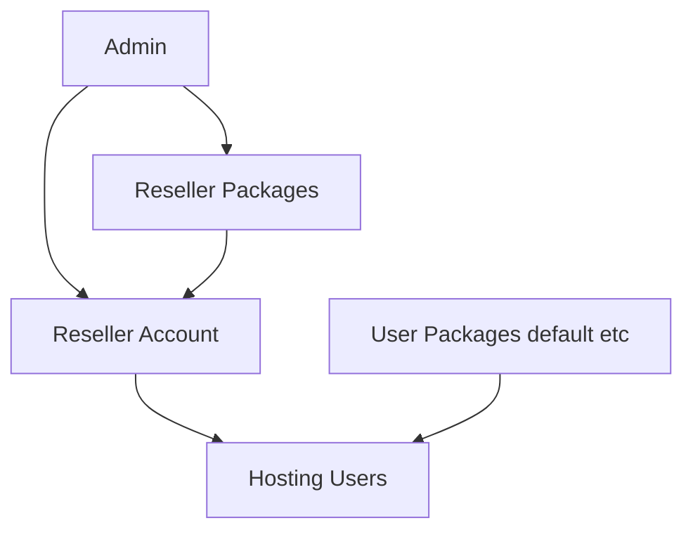

# HestiaCP Reseller Hosting Plugin

**Repository:** [github.com/Diwakerpandey/hestiacp-reseller-plugin](https://github.com/Diwakerpandey/hestiacp-reseller-plugin)

Adds **reseller hosting** to HestiaCP (similar to DirectAdmin / cPanel reseller plans). Hestia ships only `admin` and `user` roles; this plugin introduces:

- **Reseller accounts** — panel login, no hosting resources on the reseller user itself
- **Reseller packages** — max customers, pooled disk/bandwidth, which hosting packages they may sell
- **Reseller-owned hosting users** — end customers created under a reseller with enforced limits

## Architecture

| Layer | Location |
|-------|----------|
| Reseller plans | `/usr/local/hestia/data/reseller-packages/*.pkg` |
| Reseller metadata | `/usr/local/hestia/data/resellers/<user>/reseller.conf` + `users.list` |
| Child ownership | `RESELLER_OWNER='reseller'` in child's `user.conf` |
| Reseller panel account | Normal Hestia user with package `reseller-system` + `ROLE='reseller'` |

Internal data layout docs are maintained separately for maintainers.



## Install & patches (detailed guide)

**See [INSTALL.md](INSTALL.md)** for full install steps, patch list, verification commands, post-upgrade checklist, and troubleshooting.

### Quick install

On the Hestia server:

```bash
# 1) Create plugins directory (if it does not exist)
sudo mkdir -p /usr/local/hestia/plugins
sudo chmod 755 /usr/local/hestia/plugins

# 2) Clone or copy this repo, then install
cd /usr/local/hestia/plugins
sudo git clone https://github.com/Diwakerpandey/hestiacp-reseller-plugin.git
cd hestiacp-reseller-plugin
sudo bash install.sh
```

Patches are applied automatically at the end of `install.sh`.

Open as admin: `https://your-server:8083/list/reseller/`

After install, plugin files are also stored at:

`/usr/local/hestia/plugins/reseller-hosting/`

Full steps, verification, and troubleshooting: **[INSTALL.md](INSTALL.md)**.

## Workflow (sell reseller hosting)

### 1. Create hosting packages (if needed)

Use Hestia **Packages** (`/list/package/`) — e.g. `default`, `business`. These are what **end customers** receive.

### 2. Create reseller packages (plans you sell to resellers)

Admin → **Reseller Packages** (`/list/reseller-package/`) or CLI:

```bash
cat > /tmp/bronze.pkg <<'EOF'
MAX_USERS='10'
MAX_DISK='20480'
MAX_BANDWIDTH='204800'
ALLOWED_PACKAGES='default,business'
EOF
v-add-reseller-package /tmp/bronze.pkg bronze
```

Pre-installed examples: `starter`, `business` (see `data/reseller-packages/`).

| Field | Meaning |
|-------|---------|
| `MAX_USERS` | Max hosting accounts this reseller may create |
| `MAX_DISK` | Pooled disk (MB) across all their users |
| `MAX_BANDWIDTH` | Pooled bandwidth (MB) across all their users |
| `ALLOWED_PACKAGES` | Comma-separated Hestia user packages they may assign |

### 3. Create a reseller account

Admin → **Add Reseller** or:

```bash
echo 'StrongPass123!' > /tmp/pw.txt
v-add-reseller myreseller /tmp/pw.txt reseller@example.com starter "My Reseller Inc"
rm /tmp/pw.txt
```

### 4. Reseller creates customers

Reseller logs in → **Hosting Users** (`/list/reseller-user/`) → **Add Hosting User**.

CLI:

```bash
echo 'ClientPass!' > /tmp/pw.txt
v-add-reseller-user myreseller client1 /tmp/pw.txt client@site.com default
rm /tmp/pw.txt
```

## CLI reference

| Command | Description |
|---------|-------------|
| `v-list-reseller-packages [json]` | List reseller plans |
| `v-add-reseller-package <tmpfile> <name>` | Add reseller plan |
| `v-delete-reseller-package <name>` | Delete plan (if unused) |
| `v-list-resellers [json]` | List resellers + usage |
| `v-add-reseller <user> <pass\|/tmp/file> <email> <plan> [name]` | Create reseller |
| `v-delete-reseller <user> [DELETE_CHILDREN]` | Delete reseller |
| `v-list-reseller-users <reseller> [json]` | List child users |
| `v-add-reseller-user <reseller> <user> <pass> <email> <pkg> [name]` | Create child user |
| `v-delete-reseller-user <reseller> <user>` | Delete child user |
| `v-get-reseller-stats <reseller> [json]` | Usage vs limits |

## Web URLs

| URL | Who |
|-----|-----|
| `/list/reseller/` | Admin — manage resellers |
| `/list/reseller-package/` | Admin — reseller plans |
| `/add/reseller/` | Admin — new reseller |
| `/add/reseller-package/` | Admin — new plan |
| `/list/reseller-user/` | Reseller — their customers |
| `/list/reseller-user/?reseller=name` | Admin — view one reseller's users |
| `/add/reseller-user/` | Reseller — add customer |

## WHMCS / Blesta / automation

Use the CLI commands from provisioning modules (same pattern as official Hestia/WHMCS hooks):

- **Create reseller**: `v-add-reseller`
- **Suspend**: `v-suspend-user` on the reseller username
- **Create account**: `v-add-reseller-user`
- **Terminate**: `v-delete-reseller-user` or `v-delete-reseller user yes`

Pass passwords via `/tmp/` files (Hestia convention).

## UI & security patches

Documented in **[INSTALL.md](INSTALL.md)**. Summary:

- Route lockdown, role guards, panel nav, login/logout redirects  
- Reseller **Edit** / **Manage** / customer impersonation  

Re-run after Hestia updates:

```bash
sudo bash /usr/local/hestia/plugins/reseller-hosting/install.sh
# or patches only:
sudo bash /usr/local/hestia/plugins/reseller-hosting/patches/apply-security-patches.sh
```

## Uninstall

```bash
sudo bash uninstall.sh
```

Does **not** remove existing resellers or `data/resellers/` — delete those manually if needed.

## Plugin layout

```
hestiacp-reseller-plugin/
├── install.sh / uninstall.sh
├── func/reseller.sh
├── bin/v-*                    # CLI
├── data/packages/reseller-system.pkg
├── data/reseller-packages/    # starter, business samples
├── web/list|add/...           # Controllers
├── web/templates-custom/pages/
└── patches/apply-ui-patches.sh
```

## Security hardening

See **[INSTALL.md](INSTALL.md)** for patch markers, verification greps, and post-upgrade steps.

| Control | What it does |
|---------|----------------|
| **Route lockdown** | Resellers limited to reseller URLs + customer panel while impersonating |
| **Navigation** | Reseller menu: Dashboard, Hosting Users, Packages |
| **`v-change-user-role`** | Cannot grant `admin` unless `HESTIA_ALLOW_ADMIN_ROLE=yes` |
| **`v-change-user-config-value`** | Cannot set `ROLE` directly |
| **Login redirect** | Resellers land on `/list/reseller-dashboard/` |

**WHMCS/automation:** To promote a user to admin via CLI/API:

```bash
HESTIA_ALLOW_ADMIN_ROLE=yes v-change-user-role username admin
```

Never expose that env var to reseller API keys.

## Reseller managing customers (v1.3+)

On **Hosting Users**, each account has:

| Action | What it does |
|--------|----------------|
| **Edit** | Change password, email, name, hosting package |
| **Manage** | Log in as that user → add domains, mail, DB, etc. |
| **Delete** | Remove the hosting account |

After **Manage**, use the top bar **Log out (username)** to return to the reseller panel. Resellers cannot manage other resellers’ users or access server admin pages while impersonating.

## Limitations (v1.0)

- Resellers cannot create their own hosting package definitions (only assign admin-defined packages).
- Pooled limits use aggregated `U_DISK` / `U_BANDWIDTH` from child users; enforce before adding users, not continuously on every action.
- Child users still appear in global admin user list (with `RESELLER_OWNER` in `user.conf`).
- No built-in billing — integrate via WHMCS/Blesta using CLI.
- Pooled disk/bandwidth limits are enforced when **creating** users, not on every domain action (v1).

## Version

See `VERSION` (e.g. 1.3.9). Install/patch procedure: **[INSTALL.md](INSTALL.md)**.
